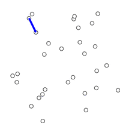
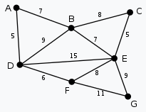
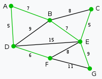
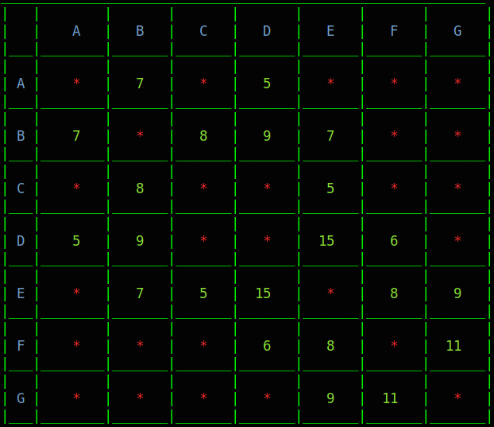

# Prim's Minimum Spanning Tree

In computer science, <b>Prim's</b> (also known as <b>Jarník's</b>) algorithm is a <i>greedy algorithm</i> that finds a <i>minimum spanning tree</i> for a <i>weighted undirected graph</i>. This means it finds a subset of the edges that forms a tree that includes every vertex, where the total weight of all the edges in the tree is minimized. The algorithm operates by building this tree one vertex at a time, from an arbitrary starting vertex, at each step adding the cheapest possible connection from the tree to another vertex.

  

## Description

The algorithm may informally be described as performing the following steps:

1. Initialize a tree with a single vertex, chosen arbitrarily from the graph.
2. Grow the tree by one edge: of the edges that connect the tree to vertices not yet in the tree, find the minimum-weight edge, and transfer it to the tree.
3. Repeat step 2 (until all vertices are in the tree).

## Time complexity

The time complexity of Prim's algorithm depends on the data structures used for the graph and for ordering the edges by weight, which can be done using a <i>priority queue</i>. The following table shows the typical choices:

| Minimum edge weight data structure	     | Time complexity (total)      
| ------------- | ------------- |
| adjacency matrix, searching         |       |
| binary heap and adjacency list        |   |
| Fibonacci heap and adjacency list        |   |

## Example

| Input Graph	     | Output Graph |      
| ------------- | ------------- |
|         |   |

## Illustration of graph in program

  <b>Input Graph</b>
    
  

  <b>Output Graph</b>
    
  

